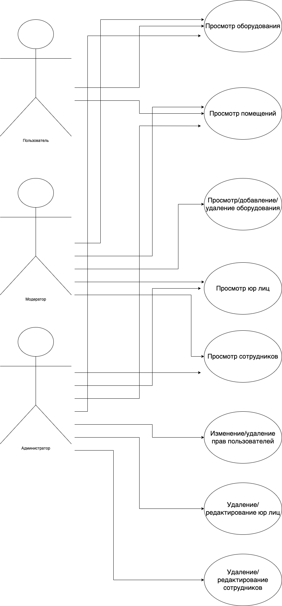
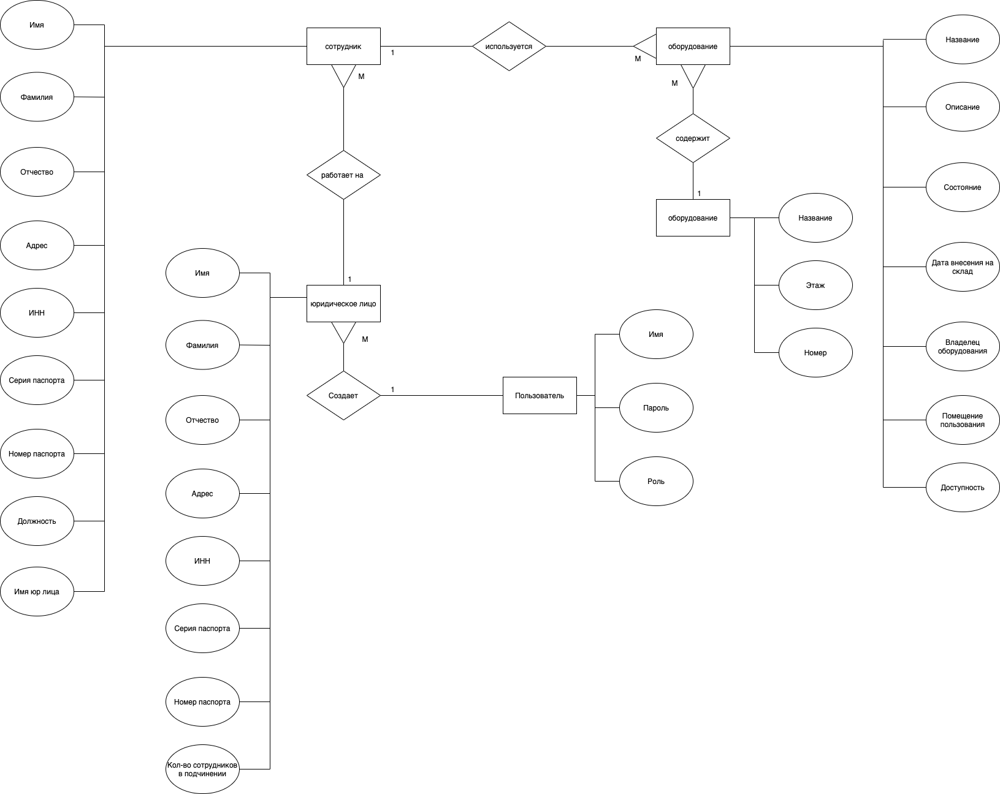

# Course Project (6 semester)

# Python + Django

## Цель работы

Проблема учета в больших предприятиях может быть решена с помощью системы инвентаризации.
Система инвентаризации - веб приложение, которое структурирует и предоставляет информацию о предприятии пользователю в удобном виде.
Цель данной работы - создать систему инвентаризации.

## Функциональные требования

Обеспечить для пользователя просмотр оборудования и помещений. Обеспечить для модератора возможность добавления имущества в базу данных. Обеспечить для администратора возможность вносить изменения в базу данных.

## Use-case диаграмма системы

## ER-диаграмма сущностей системы

