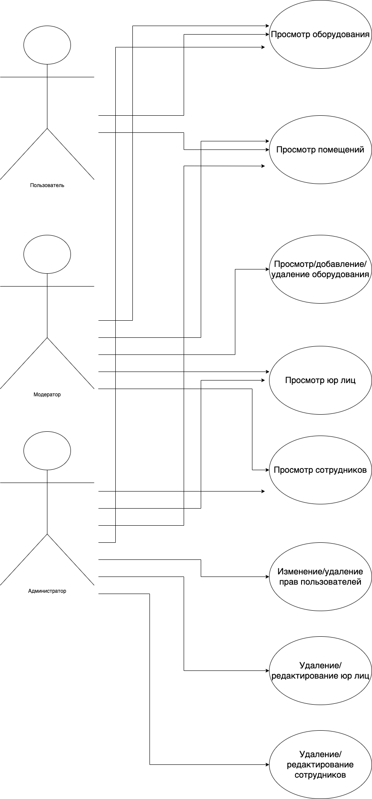
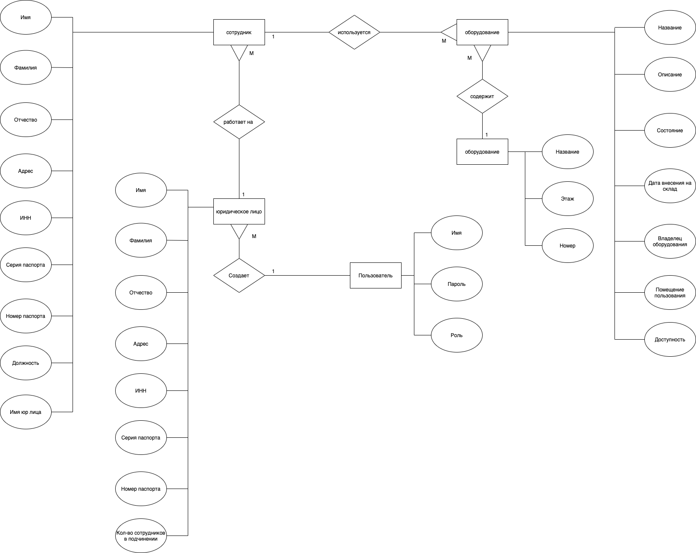

# WEB (7 semester)

# Python + Django + React

## Цель работы

Проблема учета в больших предприятиях может быть решена с помощью системы инвентаризации.
Система инвентаризации - веб приложение, которое структурирует и предоставляет информацию о предприятии пользователю в удобном виде.
Цель данной работы - создать систему инвентаризации.

## Функциональные требования

Обеспечить для пользователя просмотр оборудования и помещений. Обеспечить для модератора возможность добавления имущества в базу данных. Обеспечить для администратора возможность вносить изменения в базу данных.

## Use-case диаграмма системы

## ER-диаграмма сущностей системы

## Провести нагрузочное тестирование с помощью ApacheBenchmark
### Выполнить 100 запросов, максимум 10 одновременно, к серверу:

#### server 127.0.0.1:8000 max_fails=3 fail_timeout=30s weight=2;
egor@Egors-MacBook-Pro ProjectDjangoReact % ab -n 100 -c 10 https://127.0.0.1/
This is ApacheBench, Version 2.3 <$Revision: 1879490 $>
Copyright 1996 Adam Twiss, Zeus Technology Ltd, http://www.zeustech.net/
Licensed to The Apache Software Foundation, http://www.apache.org/

Benchmarking 127.0.0.1 (be patient).....done

Server Software:        inventory
Server Hostname:        127.0.0.1
Server Port:            443
SSL/TLS Protocol:       TLSv1.2,ECDHE-RSA-AES256-GCM-SHA384,2048,256
Server Temp Key:        ECDH X25519 253 bits

Document Path:          /
Document Length:        2959 bytes

Concurrency Level:      10
Time taken for tests:   0.259 seconds
Complete requests:      100
Failed requests:        0
Total transferred:      319700 bytes
HTML transferred:       295900 bytes
Requests per second:    385.47 [#/sec] (mean)
Time per request:       25.942 [ms] (mean)
Time per request:       2.594 [ms] (mean, across all concurrent requests)
Transfer rate:          1203.46 [Kbytes/sec] received

Connection Times (ms)
              min  mean[+/-sd] median   max
Connect:        6   16   6.1     16      62
Processing:     0    4   3.3      4      13
Waiting:        0    3   2.3      3       8
Total:         16   20   5.2     19      67

Percentage of the requests served within a certain time (ms)
  50%     19
  66%     19
  75%     19
  80%     20
  90%     24
  95%     25
  98%     25
  99%     67
 100%     67 (longest request)

#### server 127.0.0.1:8001 max_fails=1 fail_timeout=30s weight=1;
egor@Egors-MacBook-Pro ProjectDjangoReact % ab -n 100 -c 10 https://127.0.0.1/
This is ApacheBench, Version 2.3 <$Revision: 1879490 $>
Copyright 1996 Adam Twiss, Zeus Technology Ltd, http://www.zeustech.net/
Licensed to The Apache Software Foundation, http://www.apache.org/

Benchmarking 127.0.0.1 (be patient).....done

Server Software:        inventory
Server Hostname:        127.0.0.1
Server Port:            443
SSL/TLS Protocol:       TLSv1.2,ECDHE-RSA-AES256-GCM-SHA384,2048,256
Server Temp Key:        ECDH X25519 253 bits

Document Path:          /
Document Length:        2959 bytes

Concurrency Level:      10
Time taken for tests:   0.246 seconds
Complete requests:      100
Failed requests:        0
Total transferred:      319700 bytes
HTML transferred:       295900 bytes
Requests per second:    406.10 [#/sec] (mean)
Time per request:       24.625 [ms] (mean)
Time per request:       2.462 [ms] (mean, across all concurrent requests)
Transfer rate:          1267.87 [Kbytes/sec] received

Connection Times (ms)
              min  mean[+/-sd] median   max
Connect:        7   18   3.5     18      24
Processing:     0    4   3.0      4      14
Waiting:        0    3   2.1      3      10
Total:         18   22   1.9     22      27

Percentage of the requests served within a certain time (ms)
  50%     22
  66%     23
  75%     23
  80%     24
  90%     24
  95%     24
  98%     27
  99%     27
 100%     27 (longest request)

#### server 127.0.0.1:8002 max_fails=1 fail_timeout=30s weight=1;

egor@Egors-MacBook-Pro BMSTU_WEB_7_sem_2021 % ab -n 100 -c 10 https://127.0.0.1/
This is ApacheBench, Version 2.3 <$Revision: 1879490 $>
Copyright 1996 Adam Twiss, Zeus Technology Ltd, http://www.zeustech.net/
Licensed to The Apache Software Foundation, http://www.apache.org/

Benchmarking 127.0.0.1 (be patient).....done

Server Software:        inventory
Server Hostname:        127.0.0.1
Server Port:            443
SSL/TLS Protocol:       TLSv1.2,ECDHE-RSA-AES256-GCM-SHA384,2048,256
Server Temp Key:        ECDH X25519 253 bits

Document Path:          /
Document Length:        2959 bytes

Concurrency Level:      10
Time taken for tests:   0.409 seconds
Complete requests:      100
Failed requests:        0
Total transferred:      319700 bytes
HTML transferred:       295900 bytes
Requests per second:    244.26 [#/sec] (mean)
Time per request:       40.939 [ms] (mean)
Time per request:       4.094 [ms] (mean, across all concurrent requests)
Transfer rate:          762.61 [Kbytes/sec] received

Connection Times (ms)
              min  mean[+/-sd] median   max
Connect:        8   32   7.7     32      46
Processing:     1    8   5.4      8      22
Waiting:        0    6   4.0      6      20
Total:          9   40   6.0     38      53

Percentage of the requests served within a certain time (ms)
  50%     38
  66%     40
  75%     44
  80%     46
  90%     49
  95%     51
  98%     52
  99%     53
 100%     53 (longest request)
